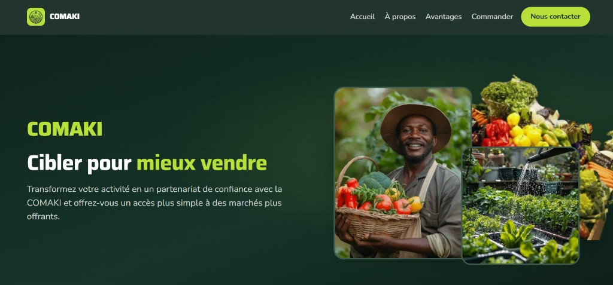
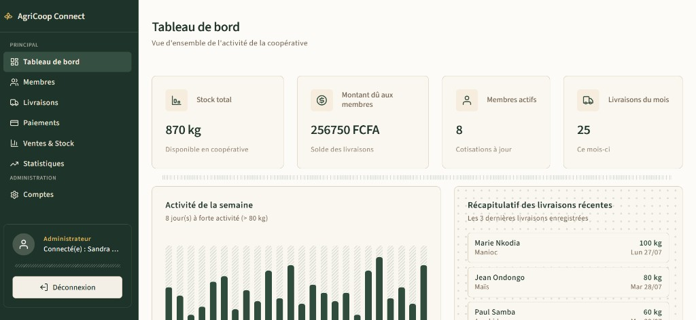
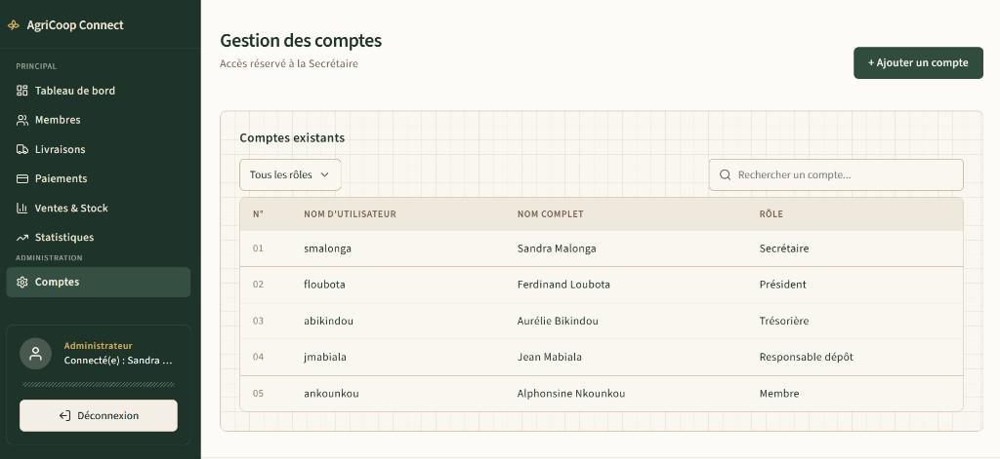

# AgriCoop Connect — Coopérative COMAKI, Kintélé

**AgriCoop Connect** est l'outil de gestion interne de la coopérative agricole **COMAKI** (Kintélé, Brazzaville). Il digitalise le suivi des membres, des livraisons, des paiements, du stock, des ventes et des statistiques, avec un module d'authentification par rôle (Secrétaire administratrice, Président, Trésorière, Responsable dépôt, Membre).

Le projet est livré en deux volets :

- **Landing publique COMAKI** (`frontend/index.html`) — vitrine à destination des acheteurs et revendeurs, avec prise de contact WhatsApp.
- **Application interne AgriCoop Connect** (`frontend/login/login.html` puis 7 pages) — outil réservé aux membres de la coopérative, accessible après connexion.

Backend : API Flask (`backend/`) — Frontend : HTML / CSS / JavaScript pur, sans framework.

## Aperçu

**Landing publique COMAKI** — vitrine destinée aux acheteurs et revendeurs.



**Tableau de bord** — indicateurs de la coopérative, activité de la semaine et dernières livraisons.



**Gestion des comptes** — écran réservé à la Secrétaire, avec la liste des comptes utilisateurs et leurs rôles.



## Fonctionnalités livrées

| Module | Ce qui est disponible |
| --- | --- |
| **Landing COMAKI** | Vitrine publique, présentation de l'offre, témoignages, contact WhatsApp |
| **Authentification** | Connexion par nom d'utilisateur + mot de passe, contrôle d'accès par rôle |
| **Tableau de bord** | Indicateurs globaux, activité de la semaine, dernières livraisons |
| **Membres** | Liste, filtrage par statut de cotisation, recherche, création d'un nouveau membre |
| **Livraisons** | Historique complet, enregistrement d'une nouvelle livraison, tri par date |
| **Paiements** | Historique, total versé, enregistrement d'un nouveau paiement |
| **Ventes & Stock** | Cartes de stock disponible, historique des ventes |
| **Statistiques** | Classement des producteurs, statistiques par culture, top acheteur, rapport partenaire (anonymisé) |
| **Comptes** | Gestion des utilisateurs — réservée à la Secrétaire |

Toutes les règles métier RM-1 à RM-7 (voir plus bas) sont appliquées côté backend.

## Lancer le projet en local

**1. Démarrer l'API (un seul terminal, à laisser ouvert)**

```bash
cd backend

# Créer l'environnement virtuel (une seule fois)
python -m venv .venv

# Activer l'environnement
.venv\Scripts\activate          # Windows
# source .venv/bin/activate     # macOS / Linux

# Installer les dépendances
pip install -r requirements.txt

# Lancer l'API
python app.py
```

L'API tourne sur `http://localhost:5000`.

**2. Ouvrir le site**

- Application interne : `frontend/login/login.html`
- Landing publique : `frontend/index.html`

Double-clic sur le fichier, ou clic droit → **Open with Live Server** (VS Code).

### Comptes de test

| Rôle | Nom d'utilisateur | Mot de passe |
| --- | --- | --- |
| Secrétaire (Admin) | `smalonga` | `Secretaire2026` |
| Président | `floubota` | `President2026` |
| Trésorière | `abikindou` | `Tresoriere2026` |
| Responsable dépôt | `jmabiala` | `Depot2026` |
| Membre | `ankounkou` | `Membre2026` |

> Les mots de passe sont volontairement stockés en clair dans `backend/data/comaki.json` : ce projet porte sur la logique métier et le contrôle d'accès par rôle, pas sur la cryptographie. En production, ces mots de passe seraient hashés.

## Structure du dépôt

```
groupe12-agricoop-connect/
├── backend/
│   ├── app.py              Routes Flask (ne pas modifier)
│   ├── controllers.py      Orchestration (ne pas modifier)
│   ├── logic.py            20 fonctions métier — Data Science
│   ├── data/comaki.json    Jeu de données unique
│   └── tests/              Tests pytest
├── frontend/
│   ├── index.html          Landing publique COMAKI
│   ├── landing.css
│   ├── main.js             Câblage API + DOM (ne pas modifier)
│   ├── functions.js        13 fonctions pures — Fullstack
│   ├── functions.test.html Tests JavaScript
│   ├── login/              Application interne — page de connexion
│   ├── dashboard/          Tableau de bord
│   ├── membres/            Gestion des membres
│   ├── livraisons/         Suivi des livraisons
│   ├── paiements/          Suivi des paiements
│   ├── ventes/             Ventes & stock
│   ├── statistiques/       Statistiques & rapport partenaire
│   ├── comptes/            Gestion des comptes (Secrétaire)
│   ├── shared/             CSS partagé (tokens, layout, composants, sidebar…)
│   └── images/             Médias de la landing
├── docs/                   Captures pour le README
└── README.md
```

## Tests

Le projet est livré **tests au vert**.

**Backend (39 tests pytest)**

```bash
cd backend
.venv\Scripts\activate
python -m pytest -v
```

**Frontend (25 tests unitaires)**

Ouvrir `frontend/functions.test.html` dans le navigateur.

## Règles métier

| Règle | Description |
| --- | --- |
| RM-1 | Une livraison à quantité ≤ 0 est refusée. |
| RM-2 | Seuls Manioc, Maïs et Arachide sont acceptés comme cultures. |
| RM-3 | Un paiement ne peut jamais dépasser le solde restant dû à un membre. |
| RM-4 | Une vente ne peut jamais dépasser le stock disponible. |
| RM-5 | Le rapport partenaire ne contient jamais de donnée nominative (aucun nom de membre). |
| RM-6 | Un utilisateur ne peut accéder qu'aux actions autorisées pour son rôle. |
| RM-7 | Un doublon quasi certain de membre propose la fiche existante plutôt que d'en créer une nouvelle. |

## Jeu de données

`backend/data/comaki.json` — source unique de vérité :

- 8 membres — 25 livraisons (avril à juillet 2026) — 8 paiements — 3 acheteurs — 9 ventes
- 5 comptes utilisateurs
- 6 villages de référence

## Routes API

```
GET  /api/dashboard
GET  /api/membres              POST /api/membres
GET  /api/membres/<id>
GET  /api/livraisons           POST /api/livraisons
GET  /api/paiements            POST /api/paiements
GET  /api/ventes-stock         POST /api/ventes-stock
GET  /api/statistiques
GET  /api/rapport-bailleur
GET  /api/utilisateurs         POST /api/utilisateurs
GET  /api/villages
POST /api/login
POST /api/verifier-acces
```

## Équipe & répartition des tâches

Ce document sert de base à la **note individuelle** ; le produit final donne la **note collective**.

### Rôles de l'équipe

| Personne | Rôle |
| --- | --- |
| **Espoir** | Lead Projet + Lead Fullstack (+ Fullstack 1) |
| **MALONGA Saint Chalbhery** | Fullstack 5 et Repo Admin |
| **Rude** | Product Owner |
| **Emmanuelle** | Lead Business Analyst |
| **Danielle** | Lead Marketing |
| **Grasty** | Fullstack 2 |
| **Beni** | Fullstack 3 |
| **Dubien** | Fullstack 4 |
| **David** | Lead Data |

### Répartition Fullstack (pages et fonctions JavaScript)

| Développeur | Lot | Pages HTML | Fonctions JavaScript (`functions.js`) |
| --- | --- | --- | --- |
| **Espoir LOEMBA** | Fullstack 1 | `login/login.html` + `dashboard/dashboard.html` | `validerFormulaireLogin`, `compterJoursActifs` |
| **Grasty SAMBA DINAULT** | Fullstack 2 | `membres/membres.html` + `comptes/comptes.html` | `filtrerMembresParStatut`, `rechercherMembreParNom`, `validerFormulaireNouveauMembre` |
| **Beni NGASSA KI** | Fullstack 3 | `livraisons/livraisons.html` | `validerFormulaireLivraison`, `trierLivraisonsParDate` |
| **Dubien NGASSAI NDONG O** | Fullstack 4 | `paiements/paiements.html` | `validerFormulairePaiement`, `calculerTotalPaiements` |
| **MALONGA Saint Chalbhery** | Fullstack 5 | `ventes/ventes.html` + `statistiques/statistiques.html` + `index.html` (landing) | `getBadgeStock`, `formaterMontant`, `trierClassementParVolume`, `formaterDate` |

### Répartition CSS

La feuille partagée `frontend/shared/` a été co-écrite ; chaque section de `components.css` est signée `@author`.

| Développeur | CSS des pages | CSS partagé |
| --- | --- | --- |
| **Espoir LOEMBA** | `login.css`, `dashboard.css` | `tokens.css`, `reset.css`, `layout.css`, `sidebar.css`, `motifs.css`, `main.css` + `components.css` : boutons, focus, graphique `.graphique/.barre` |
| **Grasty SAMBA DINAULT** | `membres.css`, `comptes.css` | `components.css` : formulaires & modales `.formulaire`, liste membres `.membre-ligne` |
| **Beni NGASSA KI** | `livraisons.css` | `components.css` : badges, messages, tableaux, `.badge`, `.livraison-ligne` |
| **Dubien NGASSAI NDONG O** | `paiements.css` | `components.css` : carte indicateur `.carte-total` |
| **MALONGA Saint Chalbhery** | `ventes.css`, `statistiques.css`, `landing.css` (seul) | `components.css` : barres de stock `.barre-stock-*`, grille bento `.grille-bento` / `.bento-carte` |

### Data Science

Complétion des 20 fonctions de `backend/logic.py` (4 zones : indicateurs, membres, livraisons/paiements, ventes/statistiques).

- Lead Data / auteur principal : **David Mbouyou**

## Contraintes techniques respectées

- **`main.js` et `app.py` / `controllers.py`** : non modifiés (contrat pédagogique).
- **`functions.js`** : uniquement des fonctions pures (paramètres → `return`), sans réseau ni DOM.
- **`backend/data/comaki.json`** : source de vérité unique, non modifiée.
- **IDs et formulaires marqués « NE PAS MODIFIER »** : préservés pour garantir le câblage backend.

## Démo (soutenance)

Scénario type :

1. Ouvrir la **landing** `frontend/index.html` — présentation publique de COMAKI.
2. Ouvrir l'**application** `frontend/login/login.html` et se connecter avec `smalonga` / `Secretaire2026`.
3. Naviguer sur les 8 pages.
4. Créer un nouveau membre.
5. Enregistrer une livraison, puis un paiement.
6. Montrer le tableau de bord, les ventes, les statistiques et le rapport partenaire (anonymisé, RM-5).

Bonne visite.
